# 🏨 Chiron-AI: Hotel Virtual Assistant

[](https://fastapi.tiangolo.com/)
[](https://www.python.org/)
[](https://github.com/ggerganov/llama.cpp)
[](https://www.docker.com/)
[](https://developer.mozilla.org/en-US/docs/Web/API/WebSocket)

**Chiron-AI** is a production-ready, AI-powered virtual concierge system for **Grand Stay Hotel** — a four-star business and leisure hotel. Built as a comprehensive NLP engineering project, it demonstrates the full lifecycle of conversational AI development from use-case design to deployment.

---

## 📑 Table of Contents

- [Overview](#-overview)
- [Architecture](#-architecture)
- [System Design](#-system-design)
- [Project Structure](#-project-structure)
- [Phase-by-Phase Breakdown](#-phase-by-phase-breakdown)
- [Features](#-features)
- [Technology Stack](#-technology-stack)
- [Installation & Setup](#-installation--setup)
- [Usage](#-usage)
- [API Documentation](#-api-documentation)
- [Configuration](#-configuration)
- [Testing](#-testing)
- [Deployment](#-deployment)
- [Performance & Optimization](#-performance--optimization)
- [Future Enhancements](#-future-enhancements)

---

## 🎯 Overview

### Purpose
Chiron-AI automates hotel front-desk interactions to provide 24/7 guest service, reduce wait times, and enhance guest satisfaction while minimizing staff workload.

### Target Users
- **New Guests**: Making reservations and inquiries
- **Arriving Guests**: Check-in assistance
- **Current Guests**: Room service, housekeeping, and amenity requests
- **Departing Guests**: Check-out and billing
- **Prospective Guests**: General information and FAQ

### Core Capabilities
1. **Room Reservations** — Book rooms with date/type preferences
2. **Check-In/Check-Out** — Streamlined arrival and departure processes
3. **Room Service** — Order food, amenities, and housekeeping
4. **FAQs** — Hotel policies, amenities, and local information
5. **Complaint Handling** — Log issues and escalate to staff when needed
6. **Intent Detection** — Context-aware conversation routing
7. **Session Management** — Multi-turn conversation with memory
8. **Real-Time Streaming** — Token-by-token WebSocket responses

---

## 🏗️ Architecture

### High-Level System Architecture

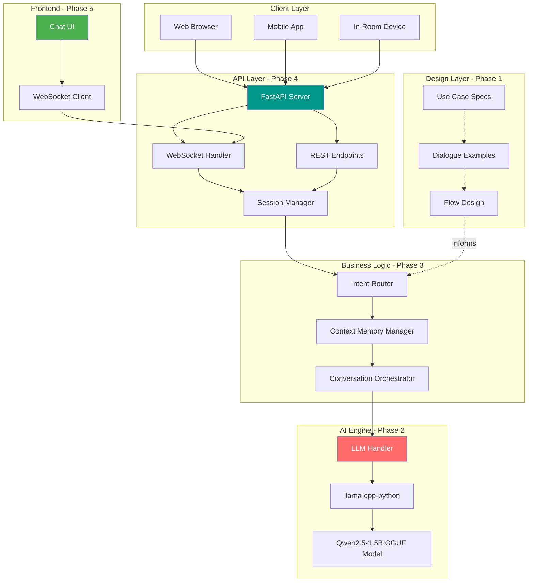

### Request Flow Architecture

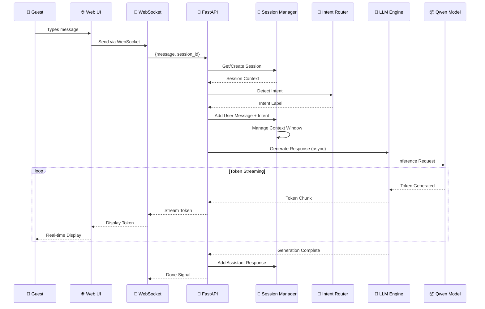

### Intent Detection Flow

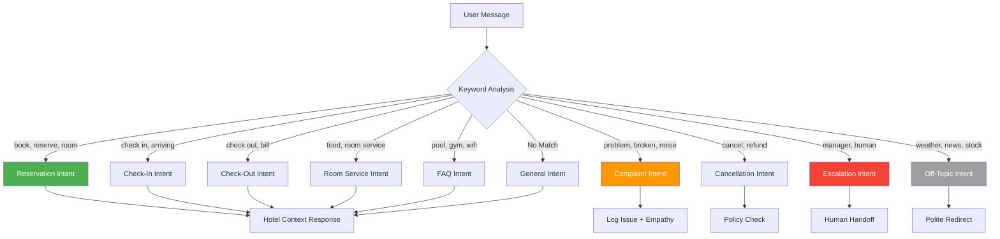

---

## 📂 Project Structure

```
📦 Chiron-AI Hotel Assistant
│
├── 📁 models/                              # LLM model files (GGUF format)
│   ├── qwen2.5-1.5b-instruct-q4_k_m.gguf  # Primary model (1.5B params, 4-bit quantized)
│   └── Qwen3-4B-Q4_K_M.gguf               # Alternative larger model
│
├── 📁 Phase 1/                             # Requirements & Design
│   ├── 1_Use_Case_Description.md          # Detailed use cases (UC-01 to UC-06)
│   ├── 2_Example_Dialogues.md             # Sample conversations for each scenario
│   └── 3_Conversational_Flow_Design.md    # State machines and flow diagrams
│
├── 📁 Phase 2/                             # LLM Engine Development
│   ├── llm_engine.ipynb                   # Jupyter notebook for model experimentation
│   └── requirements.txt                   # llama-cpp-python, huggingface-hub
│
├── 📁 Phase 3/                             # Conversation Management
│   └── conversation_manager.ipynb         # Context memory, intent detection prototyping
│
├── 📁 Phase 4/                             # Production API Service
│   ├── 📄 Dockerfile                      # Container image definition
│   ├── 📄 docker-compose.yml              # Orchestration config (ports, volumes, resources)
│   ├── 📄 requirements.txt                # FastAPI, uvicorn, websockets, pydantic
│   ├── 📄 postman_collection.json         # API testing collection
│   │
│   ├── 📁 api/                            # Python package
│   │   ├── __init__.py
│   │   ├── main.py                        # FastAPI app, WebSocket + REST endpoints
│   │   ├── llm_handler.py                 # LLM inference with async streaming
│   │   ├── models.py                      # Pydantic schemas (requests/responses)
│   │   └── session_store.py               # In-memory session management + context
│   │
│   └── 📁 tests/                          # Unit tests
│       ├── __init__.py
│       └── test_conversations.py          # Intent detection + conversation tests
│
└── 📁 Phase 5/                             # Frontend Interface
    ├── index.html                          # Full-featured chat UI (WebSocket client)
    └── home.html                           # Landing page (optional)
```

---

## 📋 Phase-by-Phase Breakdown

### 🔍 Phase 1: Requirements Analysis & Design

**Deliverables**: Use case documentation, example dialogues, conversational flow design

#### Use Cases Covered
1. **UC-01: Room Reservation** — Date selection → Room type → Guest details → Payment → Confirmation
2. **UC-02: Check-In Assistance** — Lookup reservation → Identity verification → Key issuance
3. **UC-03: Check-Out** — Bill presentation → Payment processing → Feedback request
4. **UC-04: Room Service** — Service type → Details → Order placement → ETA
5. **UC-05: FAQ & Information** — Amenities, policies, local attractions
6. **UC-06: Complaint Handling** — Issue logging → Resolution or escalation

#### Design Principles
- **Concise Responses**: Under 120 words unless presenting detailed data
- **Progressive Disclosure**: Ask 1-2 questions at a time
- **Context Retention**: Never re-ask provided information
- **Graceful Degradation**: Escalate to humans when needed
- **Off-Topic Handling**: Polite redirection to hotel-related topics

#### Flow Example: Room Reservation

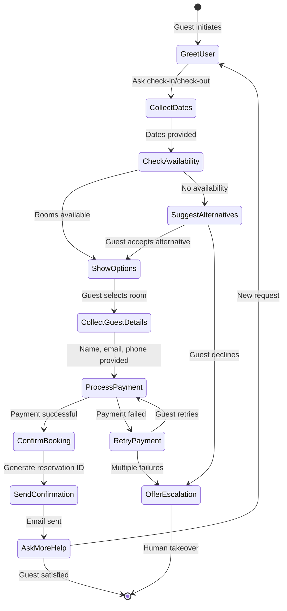

### 🧠 Phase 2: LLM Engine Implementation

**Deliverables**: Working LLM inference pipeline with streaming

#### Model Selection
- **Model**: Qwen2.5-1.5B-Instruct (Alibaba Cloud)
- **Format**: GGUF with Q4_K_M quantization (4-bit for CPU efficiency)
- **Context Window**: 8000 tokens (sufficient for hotel conversations)
- **Inference Library**: llama-cpp-python (CPU-optimized)

#### Key Technical Decisions

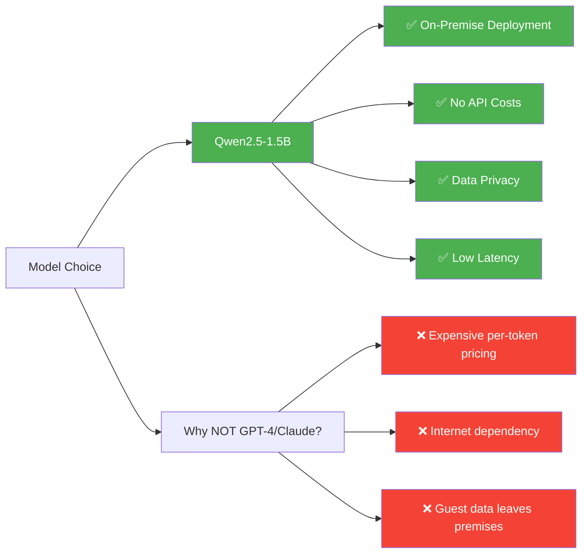

#### System Prompt Engineering
The system prompt is ~4000 tokens and includes:
- **Identity & Tone**: Professional yet approachable concierge persona
- **Hotel Details**: Address, rooms (4 types), amenities (pool, gym, spa, restaurant)
- **Service Catalog**: Room service menu, prices, hours
- **Policies**: Check-in/out times, cancellation rules, pet policy
- **Sample Conversations**: Few-shot examples for each intent
- **Behavioral Rules**: Off-topic handling, escalation triggers

#### Streaming Architecture
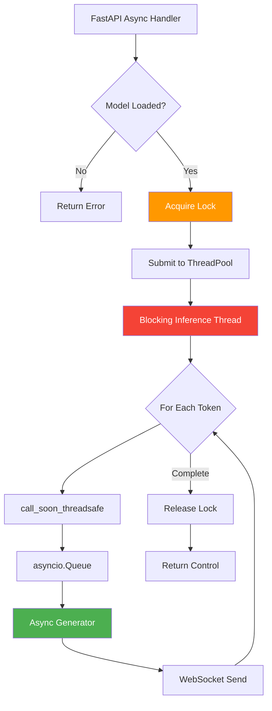

**Why This Works:**
- llama.cpp is **not thread-safe** → Single `asyncio.Lock` serializes inference
- Blocking C++ inference → Runs in `ThreadPoolExecutor` to avoid blocking event loop
- Tokens produced in thread → Pushed to async queue via `call_soon_threadsafe()`
- Multiple WebSocket connections → Queue up behind the lock

### 🗣️ Phase 3: Conversation Management

**Deliverables**: Session-based context memory and intent routing

#### Architecture Components

1. **Session Store** (`session_store.py`)
   - In-memory dictionary of active sessions
   - Each session has a unique UUID
   - TTL-based cleanup (future enhancement)

2. **Context Memory Manager**
   - **Sliding Window**: Keeps last N turns (default: 20)
   - **Filler Removal**: Strips low-information messages ("ok", "thanks") from older context
   - **Recent Guard**: Preserves last 6 turns verbatim
   - **Why?** Prevents context overflow while retaining important conversation history

3. **Intent Detection**
   - **Method**: Keyword-based pattern matching
   - **9 Intents**: reservation, check_in, check_out, room_service, complaint, cancellation, escalation, faq, off_topic
   - **Scoring**: Count keyword matches per intent; highest score wins
   - **Off-Topic Priority**: If off-topic keywords present, trigger redirect response

#### Context Management Flow

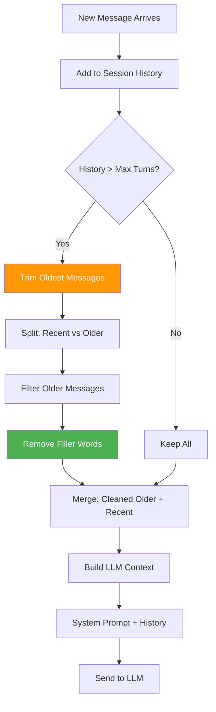

#### Intent Routing Logic

```python
# Example: How intent affects response
intent = detect_intent(user_message)

if intent == "off_topic":
    response = "I specialize in hotel services. How can I assist with your stay?"
elif intent == "escalation":
    response = "I'll connect you with our front desk team. Please hold..."
elif intent == "complaint":
    log_complaint(session_id, message)
    response = "I'm sorry to hear that. Let me help resolve this..."
else:
    # Normal LLM generation with hotel context
    response = await stream_llm_response(session, user_message)
```

### 🚀 Phase 4: API Service (Production Backend)

**Deliverables**: FastAPI microservice with WebSocket + REST, Dockerized deployment

#### Endpoints Overview

| Type       | Endpoint                    | Description                                 |
|------------|-----------------------------|---------------------------------------------|
| WebSocket  | `WS /ws/chat`               | Primary streaming chat interface            |
| REST GET   | `/health`                   | Service health (model loaded, session count)|
| REST POST  | `/sessions`                 | Create new session → returns `session_id`   |
| REST GET   | `/sessions`                 | List all active session IDs                 |
| REST GET   | `/sessions/{id}/stats`      | Get session stats (turns, tokens, etc.)     |
| REST DELETE| `/sessions/{id}`            | Close/delete a session                      |
| Static     | `/` or `/chat`              | Serve frontend HTML                         |

#### WebSocket Protocol

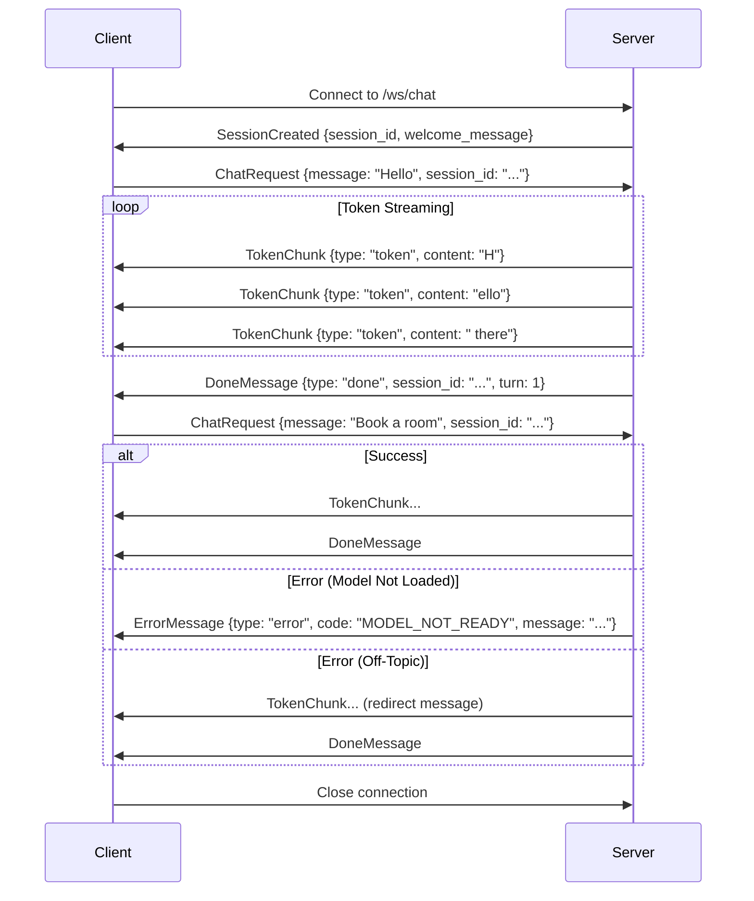

#### Pydantic Models (Type Safety)

```python
# Request Models
class ChatRequest(BaseModel):
    message: str
    session_id: str

# Response Models (WebSocket)
class SessionCreated(BaseModel):
    type: Literal["session_created"] = "session_created"
    session_id: str
    welcome_message: str

class TokenChunk(BaseModel):
    type: Literal["token"] = "token"
    content: str

class DoneMessage(BaseModel):
    type: Literal["done"] = "done"
    session_id: str
    turn: int
    timestamp: float

class ErrorMessage(BaseModel):
    type: Literal["error"] = "error"
    code: str  # "MODEL_NOT_READY", "INVALID_SESSION", etc.
    message: str

# REST Response Models
class HealthResponse(BaseModel):
    status: Literal["ok", "degraded"]
    model_loaded: bool
    active_sessions: int
    model_name: str

class SessionStats(BaseModel):
    session_id: str
    turn_count: int
    created_at: float
    last_activity: float
    detected_intents: list[str]
```

#### Lifecycle Management

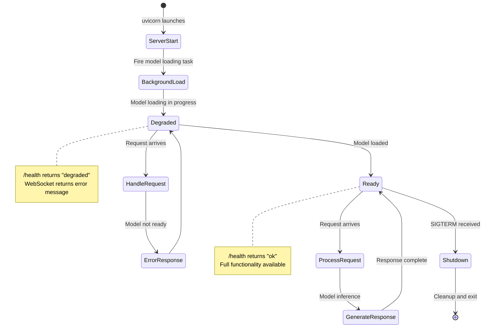

#### Docker Configuration

**Why Docker?**
- **Isolation**: Dependencies don't conflict with host system
- **Reproducibility**: Same environment on any machine
- **Portability**: Deploy to any cloud provider or on-premise
- **Resource Limits**: CPU/memory constraints to prevent overload

**Resource Allocation:**
```yaml
resources:
  limits:
    cpus: "4.0"        # Max 4 cores (adjust for server)
    memory: 4G         # 4GB RAM (model ~1GB + overhead)
```

**Volume Mounting:**
```yaml
volumes:
  - ../models:/models:ro   # Read-only access to GGUF files
```
- Models stay outside container (no rebuild on model change)
- `:ro` flag prevents accidental modification

### 🎨 Phase 5: Frontend Interface

**Deliverables**: Production-grade web UI with luxury hotel aesthetics

#### Design Philosophy
- **Brand Identity**: Warm earth tones (terracotta, sand, sage) reflecting luxury hospitality
- **Typography**: Playfair Display (headings) + Inter (body) for elegance + readability
- **Responsiveness**: Mobile-first design with desktop enhancements
- **Accessibility**: ARIA labels, keyboard navigation, high contrast ratios

#### UI Components Flow

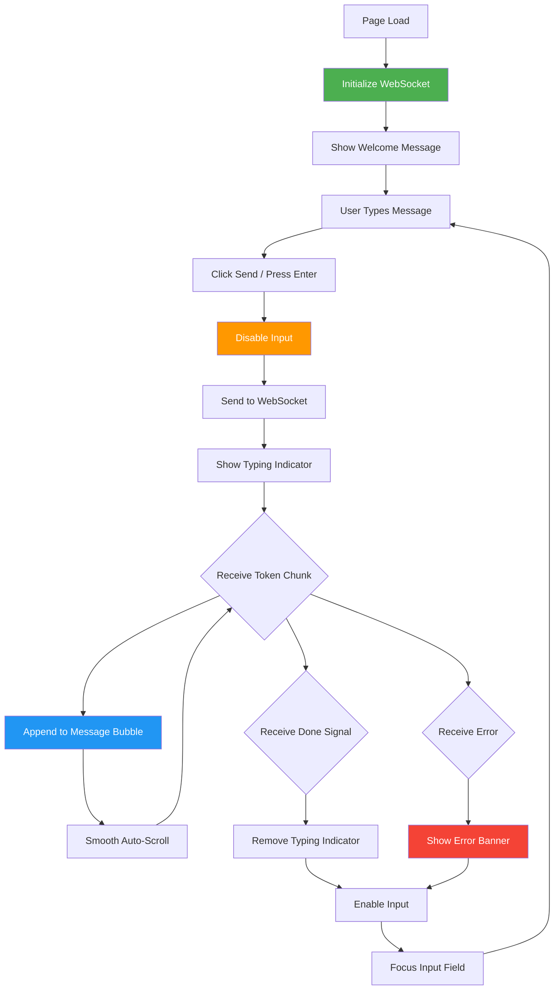

#### Key Features
1. **Token-by-Token Streaming**: Real-time display as LLM generates
2. **Auto-Scroll**: Smooth scrolling with user-scroll detection
3. **Connection Status**: Visual indicators for WebSocket state
4. **Error Handling**: Graceful degradation with retry options
5. **Message History**: Persists in session (cleared on refresh)
6. **Markdown Support**: Formatted responses (bold, lists, tables)

#### WebSocket Client Implementation

```javascript
// Simplified client logic
const ws = new WebSocket('ws://localhost:8000/ws/chat');

ws.onmessage = (event) => {
    const data = JSON.parse(event.data);
    
    switch(data.type) {
        case 'session_created':
            sessionId = data.session_id;
            displayWelcome(data.welcome_message);
            break;
            
        case 'token':
            appendToCurrentMessage(data.content);
            break;
            
        case 'done':
            finalizeBotMessage();
            enableInput();
            break;
            
        case 'error':
            showError(data.message);
            enableInput();
            break;
    }
};

function sendMessage(text) {
    ws.send(JSON.stringify({
        message: text,
        session_id: sessionId
    }));
    disableInput();
    showTypingIndicator();
}
```

---

## ✨ Features

### Core Functionality
- ✅ **Multi-Turn Conversations** with context retention (20-turn sliding window)
- ✅ **Intent Classification** (9 intents: reservation, check-in/out, service, FAQ, etc.)
- ✅ **Real-Time Streaming** via WebSocket (token-by-token display)
- ✅ **Session Management** (create, list, stats, delete)
- ✅ **Off-Topic Detection** with polite redirection
- ✅ **Complaint Logging** with automatic escalation triggers
- ✅ **Graceful Degradation** when model isn't loaded

### Technical Features
- ✅ **Async Architecture** (non-blocking WebSocket + REST)
- ✅ **Thread-Safe Inference** (lock-based concurrency control)
- ✅ **Docker Deployment** (containerized with resource limits)
- ✅ **Health Monitoring** (readiness checks for orchestration)
- ✅ **CORS Support** (cross-origin requests enabled)
- ✅ **Type Safety** (Pydantic models for all API contracts)
- ✅ **Comprehensive System Prompt** (~4000 tokens with hotel knowledge)

### Hotel-Specific Capabilities
- 📦 **Room Types**: 4 categories (Standard Single/Double, Deluxe Double, Junior Suite)
- 🍽️ **Room Service**: Full menu with prices and dietary options
- 🏊 **Amenities**: Pool, gym, spa with hours and policies
- 🚗 **Services**: Parking, WiFi, pet policy, early check-in/late check-out
- 📍 **Local Info**: Nearby attractions, restaurants, transportation
- 💳 **Pricing**: Dynamic rate information with seasonal variations

---

## 🛠️ Technology Stack

### Backend
| Component | Technology | Purpose |
|-----------|-----------|---------|
| **Web Framework** | FastAPI 0.111+ | High-performance async API framework |
| **ASGI Server** | Uvicorn 0.29+ | Production-grade WebSocket + HTTP server |
| **WebSocket** | websockets 12.0+ | Bi-directional real-time communication |
| **LLM Inference** | llama-cpp-python 0.3.4+ | CPU-optimized inference engine |
| **Validation** | Pydantic 2.7+ | Type-safe request/response models |
| **HTTP Client** | httpx 0.27+ | Async HTTP for external integrations |

### Frontend
| Component | Technology | Purpose |
|-----------|-----------|---------|
| **Core** | Vanilla JavaScript | No framework overhead, fast load times |
| **WebSocket API** | Native WebSocket | Browser-native real-time connection |
| **Styling** | Custom CSS | Luxury hotel branding (no Bootstrap/Tailwind) |
| **Fonts** | Google Fonts | Playfair Display + Inter |
| **Icons** | Unicode & CSS | No external icon libraries needed |

### Infrastructure
| Component | Technology | Purpose |
|-----------|-----------|---------|
| **Containerization** | Docker | Reproducible deployment environment |
| **Orchestration** | Docker Compose | Multi-service configuration |
| **Models** | GGUF (Qwen2.5) | Quantized LLM format (1.5B params) |
| **Storage** | In-Memory | Sessions & context (Redis upgrade path) |

### Development Tools
- **Testing**: Python `pytest` (see `/Phase 4/tests/`)
- **API Testing**: Postman collection (`postman_collection.json`)
- **Notebooks**: Jupyter Lab (Phase 2 & 3 experimentation)
- **Version Control**: Git (`.gitignore` included)

---

## 🚀 Installation & Setup

### Prerequisites
- **Python**: 3.11+ (3.12 recommended)
- **Docker**: 20.10+ (optional, for containerized deployment)
- **RAM**: Minimum 4GB free (8GB recommended)
- **CPU**: Modern multi-core processor (no GPU required)
- **OS**: Windows 10/11, macOS 11+, or Linux (Ubuntu 20.04+)

### Option 1: Local Installation (Development)

#### Step 1: Clone Repository
```bash
git clone <your-repo-url>
cd "Vs github copilot"  # Note: Adjust path based on your structure
```

#### Step 2: Set Up Python Environment
```bash
# Create virtual environment
python -m venv venv

# Activate (Windows)
venv\Scripts\activate

# Activate (macOS/Linux)
source venv/bin/activate
```

#### Step 3: Install Dependencies
```bash
cd "Phase 4"
pip install --upgrade pip setuptools wheel
pip install -r requirements.txt
```

**Note**: `llama-cpp-python` will compile during installation (5-10 minutes). For GPU support:
```bash
CMAKE_ARGS="-DLLAMA_CUDA=on" pip install llama-cpp-python --force-reinstall
```

#### Step 4: Verify Model Files
Ensure GGUF model is present:
```bash
# Expected path: models/qwen2.5-1.5b-instruct-q4_k_m.gguf
ls ../models/*.gguf
```

If missing, download from HuggingFace:
```bash
pip install huggingface-hub
huggingface-cli download Qwen/Qwen2.5-1.5B-Instruct-GGUF \
  qwen2.5-1.5b-instruct-q4_k_m.gguf --local-dir ../models/
```

#### Step 5: Run the Server
```bash
cd "Phase 4"
uvicorn api.main:app --host 0.0.0.0 --port 8000 --reload
```

**Expected Output:**
```
INFO:     Uvicorn running on http://0.0.0.0:8000 (Press CTRL+C to quit)
INFO:     Started reloader process [PID]
INFO:     Started server process [PID]
INFO:     Waiting for application startup.
INFO:     Application startup complete.
```

Check health endpoint:
```bash
curl http://localhost:8000/health
# Response: {"status":"degraded","model_loaded":false, ...}  (will become "ok" after ~30s)
```

Visit the UI: **http://localhost:8000/chat**

---

### Option 2: Docker Deployment (Production)

#### Step 1: Navigate to Phase 4
```bash
cd "Phase 4"
```

#### Step 2: Build & Launch
```bash
docker-compose up --build
```

This command:
1. Builds the Docker image (~5 minutes first time)
2. Mounts the `models/` directory
3. Exposes port 8000
4. Sets resource limits (4 CPU cores, 4GB RAM)
5. Configures health checks

#### Step 3: Verify Deployment
```bash
# Check container status
docker ps

# View logs
docker logs chiron-ai --follow

# Test health endpoint
curl http://localhost:8000/health
```

#### Step 4: Access Application
Open browser to: **http://localhost:8000/chat**

#### Stop & Cleanup
```bash
docker-compose down          # Stop container
docker-compose down -v       # Stop + remove volumes
```

---

### Configuration

#### Environment Variables

Create a `.env` file in `Phase 4/` directory:

```bash
# Model Configuration
MODEL_DIR=/models                        # Path to GGUF files
MODEL_FILE=qwen2.5-1.5b-instruct-q4_k_m.gguf

# Inference Parameters
MAX_TOKENS=512                           # Max generation length
TEMPERATURE=0.7                          # Creativity (0.0=deterministic, 1.0=creative)
TOP_P=0.9                                # Nucleus sampling threshold
CONTEXT_SIZE=8000                        # LLM context window

# Performance Tuning
N_THREADS=4                              # CPU threads for inference
N_GPU_LAYERS=0                           # GPU layers (0=CPU only, 35=all on GPU)

# Server Settings
HOST=0.0.0.0                             # Listen address
PORT=8000                                # HTTP port
WORKERS=1                                # Uvicorn workers (keep at 1 for stateful LLM)
```

**Load with Docker Compose:**
```yaml
# In docker-compose.yml
services:
  chiron-api:
    env_file:
      - .env
```

---

## 📖 Usage

### Basic Chat Flow

1. **Open the UI**: Navigate to `http://localhost:8000/chat`
2. **Automatic Connection**: WebSocket connects on page load
3. **Welcome Message**: "Hello! I'm Chiron-AI, your virtual concierge..."
4. **Start Chatting**:
   ```
   You: I'd like to book a room
   Chiron: I'd be happy to help with a reservation. When would you like to check in?
   ```

### Example Conversations

#### Scenario 1: Room Reservation
```
Guest: I need a room for next weekend
Chiron: Perfect! Which specific dates did you have in mind?

Guest: Check-in Friday July 12th, check-out Sunday July 14th
Chiron: Thank you! For July 12-14 (2 nights), what room type would you prefer?
        • Standard Single — $95/night
        • Standard Double — $120/night  
        • Deluxe Double — $150/night
        • Junior Suite — $210/night

Guest: Double room please
Chiron: Excellent choice! A Standard Double is available at $120/night 
        (total: $240 for 2 nights). This includes:
        • Two queen beds
        • City view
        • Free WiFi & breakfast for 2
        Shall I proceed with this booking?

Guest: Yes
Chiron: Great! May I have your full name, email, and phone number?

Guest: John Smith, john@email.com, 555-0123
Chiron: Thank you, John! Your reservation is confirmed.
        
        📋 Booking Details:
        • Reservation ID: GS-20240712-8421
        • Room: Standard Double, Floor 6
        • Dates: July 12-14, 2024
        • Total: $240
        
        A confirmation email has been sent to john@email.com.
        Is there anything else I can help you with?
```

#### Scenario 2: FAQ
```
Guest: What time is breakfast?
Chiron: Breakfast is served at the Garden Restaurant from 7:00 AM to 10:30 AM daily.
        Our breakfast buffet includes:
        • Hot items: eggs, bacon, sausages, pancakes
        • Continental: pastries, cereals, yogurt, fruit
        • Beverages: coffee, tea, juices, smoothies
        
        Would you like to know about any other amenities?
```

#### Scenario 3: Complaint Handling
```
Guest: The AC in my room isn't working
Chiron: I'm sorry to hear about the air conditioning issue. That must be uncomfortable.
        May I have your room number so I can dispatch maintenance immediately?

Guest: Room 512
Chiron: Thank you. I've created an urgent maintenance request for Room 512.
        Our engineering team will arrive within 15 minutes to resolve this.
        
        In the meantime, would you like me to:
        • Arrange a temporary room change?
        • Send additional fans?
        
        I'll personally follow up to ensure this is resolved promptly.
```

#### Scenario 4: Off-Topic Detection
```
Guest: What's the weather forecast for tomorrow?
Chiron: I specialize in hotel services and amenities. For local weather, I recommend 
        checking weather.com or asking our front desk for recommendations.
        
        Is there anything related to your stay I can assist with?
```

---

### REST API Usage

#### Create a Session (Programmatic)
```bash
curl -X POST http://localhost:8000/sessions
```
**Response:**
```json
{
  "session_id": "a3f2b8c9-7e4d-4a1b-9f3c-2d8e5a7b1c4f",
  "message": "Session created. Connect to /ws/chat to begin."
}
```

#### List All Sessions
```bash
curl http://localhost:8000/sessions
```
**Response:**
```json
{
  "session_ids": ["a3f2b8c9-...", "d1e4f7a2-..."],
  "count": 2
}
```

#### Get Session Statistics
```bash
curl http://localhost:8000/sessions/{session_id}/stats
```
**Response:**
```json
{
  "session_id": "a3f2b8c9-7e4d-4a1b-9f3c-2d8e5a7b1c4f",
  "turn_count": 5,
  "created_at": 1720789234.56,
  "last_activity": 1720789456.78,
  "detected_intents": ["reservation", "faq", "general"]
}
```

#### Delete a Session
```bash
curl -X DELETE http://localhost:8000/sessions/{session_id}
```
**Response:** `204 No Content`

---

### WebSocket API Usage (JavaScript)

```javascript
const ws = new WebSocket('ws://localhost:8000/ws/chat');
let sessionId = null;

// Connection established
ws.onopen = () => {
    console.log('Connected to Chiron-AI');
};

// Receive messages
ws.onmessage = (event) => {
    const data = JSON.parse(event.data);
    
    if (data.type === 'session_created') {
        sessionId = data.session_id;
        console.log('Session ID:', sessionId);
        console.log('Welcome:', data.welcome_message);
    }
    
    else if (data.type === 'token') {
        process.stdout.write(data.content);  // Stream tokens
    }
    
    else if (data.type === 'done') {
        console.log('\n[Turn', data.turn, 'complete]');
    }
    
    else if (data.type === 'error') {
        console.error('Error:', data.code, data.message);
    }
};

// Send a message
function chat(message) {
    ws.send(JSON.stringify({
        message: message,
        session_id: sessionId
    }));
}

// Example usage
setTimeout(() => chat("I'd like to book a room"), 1000);
```

---

## 🧪 Testing

### Unit Tests

Located in `Phase 4/tests/test_conversations.py`:

```bash
cd "Phase 4"
pytest tests/ -v
```

**Test Coverage:**
- ✅ Intent detection accuracy for all 9 intents
- ✅ Context memory trimming and filler removal
- ✅ Session creation and deletion
- ✅ Edge cases (empty messages, long inputs, special characters)

### Integration Tests (Postman)

Import `Phase 4/postman_collection.json` into Postman:

1. **Health Check** — Verify service is running
2. **Create Session** — Get a new session ID
3. **WebSocket Chat** — (Manual test in Postman or browser)
4. **List Sessions** — See all active sessions
5. **Session Stats** — View turn count and intents
6. **Delete Session** — Cleanup

### Manual Testing Checklist

- [ ] **Long Conversation**: 20+ turns to test context trimming
- [ ] **Concurrent Users**: Open 3+ browser tabs simultaneously
- [ ] **Intent Coverage**: Test all 9 intent types
- [ ] **Escalation**: Trigger "speak to manager" phrases
- [ ] **Off-Topic**: Ask about weather, stocks, etc.
- [ ] **Error Handling**: Disconnect WiFi mid-chat
- [ ] **Mobile UI**: Test on phone/tablet screen sizes
- [ ] **Performance**: Check response time < 3 seconds per message

---

## 🚢 Deployment

### Cloud Deployment Options

#### Option 1: AWS ECS (Elastic Container Service)
```bash
# Build for ARM64 (Graviton instances)
docker buildx build --platform linux/arm64 -t chiron-ai:latest .

# Push to ECR
aws ecr get-login-password --region us-east-1 | docker login --username AWS --password-stdin <ecr-url>
docker tag chiron-ai:latest <ecr-url>/chiron-ai:latest
docker push <ecr-url>/chiron-ai:latest

# Deploy via ECS task definition (WebSocket-compatible ALB required)
```

#### Option 2: Google Cloud Run
```bash
# Build and push
gcloud builds submit --tag gcr.io/<project-id>/chiron-ai

# Deploy (note: Cloud Run supports WebSockets as of 2023)
gcloud run deploy chiron-ai \
  --image gcr.io/<project-id>/chiron-ai \
  --platform managed \
  --region us-central1 \
  --memory 4Gi \
  --cpu 4 \
  --allow-unauthenticated
```

#### Option 3: Azure Container Instances
```bash
# Create resource group
az group create --name chiron-rg --location eastus

# Deploy container
az container create \
  --resource-group chiron-rg \
  --name chiron-ai \
  --image <acr-url>/chiron-ai:latest \
  --cpu 4 \
  --memory 4 \
  --dns-name-label chiron-hotel-ai \
  --ports 8000 \
  --environment-variables MODEL_DIR=/models
```

### On-Premise Deployment

```bash
# Use docker-compose in production mode
docker-compose -f docker-compose.prod.yml up -d

# Set up reverse proxy (Nginx example)
# /etc/nginx/sites-available/chiron-ai
server {
    listen 80;
    server_name hotel.example.com;
    
    location / {
        proxy_pass http://localhost:8000;
        proxy_http_version 1.1;
        proxy_set_header Upgrade $http_upgrade;
        proxy_set_header Connection "upgrade";  # WebSocket support
        proxy_set_header Host $host;
    }
}
```

### Production Checklist

- [ ] **Environment Variables**: Move secrets to vault (AWS Secrets Manager, etc.)
- [ ] **HTTPS**: Enable TLS with Let's Encrypt or cloud provider
- [ ] **CORS**: Restrict `allow_origins` to specific domains
- [ ] **Rate Limiting**: Add nginx/API Gateway limits (e.g., 100 req/min per IP)
- [ ] **Monitoring**: Integrate Prometheus + Grafana for metrics
- [ ] **Logging**: Ship logs to ELK stack or CloudWatch
- [ ] **Backups**: If adding persistent storage (Redis), configure snapshots
- [ ] **Load Balancing**: Use multiple replicas behind ALB/NLB
- [ ] **Auto-Scaling**: Scale based on CPU/memory/session count
- [ ] **Health Checks**: Configure orchestrator to respect `/health` endpoint

---

## ⚡ Performance & Optimization

### Current Benchmarks
- **Response Latency**: 2-4 seconds for 150-token responses
- **Throughput**: ~10 concurrent users on 4-core CPU (serialized by lock)
- **Memory Usage**: 2GB (1GB model + 1GB overhead)
- **Token Speed**: ~40 tokens/second (Q4 quantization on modern CPU)

### Optimization Strategies

#### 1. Model Quantization
```bash
# Current: Q4_K_M (4-bit, medium)
# Options:
# - Q2_K: Faster, lower quality
# - Q5_K_M: Slower, higher quality
# - Q8_0: Near-original quality, 2x size
```

#### 2. Batch Inference (Future)
```python
# Replace single-request lock with batch queue
# Process N requests together for 2-3x throughput
# Requires API redesign (non-trivial)
```

#### 3. GPU Acceleration
```bash
# Build with CUDA support
CMAKE_ARGS="-DLLAMA_CUDA=on" pip install llama-cpp-python

# Set in .env
N_GPU_LAYERS=35  # Offload all layers to GPU
```
**Result**: 5-10x faster inference (requires NVIDIA GPU with 4GB+ VRAM)

#### 4. Redis Backend (Scalability)
```python
# Replace in-memory sessions with Redis
# Enables horizontal scaling with shared state
import redis
session_store = redis.Redis(host='redis', port=6379)
```

#### 5. Context Caching
```python
# Cache system prompt in KV cache
# Reduces repetitive encoding cost by 30%
# (requires llama.cpp API update)
```

### Cost Analysis

**On-Premise Deployment (Per Month):**
- Server: $50-200 (or existing infrastructure)
- Electricity: ~$10 (24/7 operation)
- **Total**: ~$60-210/month

**Cloud Deployment (AWS, 4 vCPU, 8GB RAM):**
- EC2 t3.xlarge: ~$120/month (reserved instance)
- ALB: ~$20/month
- **Total**: ~$140/month

**vs. OpenAI API:**
- 1M tokens = $10-60 (depending on model)
- 10,000 guest conversations/month ≈ 50M tokens
- **Total**: $500-3000/month + latency + data privacy concerns

**ROI**: Self-hosted pays for itself after 1-2 months of operation.

---

## 🔮 Future Enhancements

### Short-Term (Phase 6)
- [ ] **Persistent Storage**: Replace in-memory sessions with Redis/PostgreSQL
- [ ] **User Authentication**: JWT-based guest login with reservation lookup
- [ ] **Multilingual Support**: Spanish, French, Mandarin prompts
- [ ] **Voice Interface**: Integrate Web Speech API for voice input/output
- [ ] **Sentiment Analysis**: Detect frustrated guests and auto-escalate
- [ ] **Analytics Dashboard**: Session metrics, intent distribution, response times

### Mid-Term (Phase 7-8)
- [ ] **PMS Integration**: Connect to real Property Management System (Opera, Amadeus)
- [ ] **Payment Gateway**: Stripe/PayPal integration for actual bookings
- [ ] **Email Notifications**: Send confirmation/reminder emails via SendGrid
- [ ] **Mobile App**: React Native app with push notifications
- [ ] **Admin Panel**: Staff dashboard to monitor escalations and override responses
- [ ] **A/B Testing**: Compare response strategies and measure satisfaction

### Long-Term (Phase 9+)
- [ ] **Multi-Model Routing**: Use smaller models for FAQs, larger for complex requests
- [ ] **Retrieval-Augmented Generation (RAG)**: Embed hotel docs for accurate policy answers
- [ ] **Fine-Tuning**: Train on real hotel conversation data for domain adaptation
- [ ] **Proactive Outreach**: "Your room is ready!" / "Check-out reminder"
- [ ] **Loyalty Program**: Track guest preferences and offer personalized recommendations
- [ ] **IoT Integration**: Control room temperature, lighting via chat commands

---

## 📝 License & Attribution

This project was developed as an academic assignment for **NLP (Natural Language Processing)** coursework. It demonstrates:
- **Software Engineering**: Modular architecture, containerization, CI/CD-ready
- **NLP Techniques**: Intent classification, context management, prompt engineering
- **Full-Stack Development**: Backend API + Frontend UI + Infrastructure

### Technologies Used
- **Qwen2.5** by Alibaba Cloud (Apache 2.0 License)
- **llama.cpp** by Georgi Gerganov (MIT License)
- **FastAPI** by Sebastián Ramírez (MIT License)

### Disclaimer
**This is a demonstration project, not production software.** For real hotel deployment:
- Replace keyword-based intent detection with supervised ML (BERT, RoBERTa)
- Implement proper authentication and authorization
- Add comprehensive logging, monitoring, and error tracking
- Conduct security audits (SQL injection, XSS, CSRF prevention)
- Comply with data protection regulations (GDPR, CCPA)

---

## 🤝 Contributing

While this is an academic project, contributions for learning purposes are welcome:

1. **Fork** the repository
2. **Create** a feature branch (`git checkout -b feature/amazing-feature`)
3. **Commit** your changes (`git commit -m 'Add amazing feature'`)
4. **Push** to the branch (`git push origin feature/amazing-feature`)
5. **Open** a Pull Request

### Contribution Ideas
- Implement Redis backend for session storage
- Add unit tests for WebSocket protocol
- Create Kubernetes deployment manifests
- Build a monitoring dashboard with metrics
- Add speech-to-text for voice input

---

## 📧 Support & Contact

For questions or feedback regarding this project:

- **Issues**: Use GitHub Issues for bug reports
- **Discussions**: Use GitHub Discussions for questions
- **Email**: *(Add your university/personal email)*

---

## 🙏 Acknowledgments

- **Alibaba Cloud** for the Qwen model series
- **Georgi Gerganov** for llama.cpp and quantization techniques
- **FastAPI Community** for excellent async framework documentation
- **HuggingFace** for model hosting and GGUF format standardization
- **VS Code & GitHub Copilot** for AI-assisted development

---

## 📊 Project Statistics

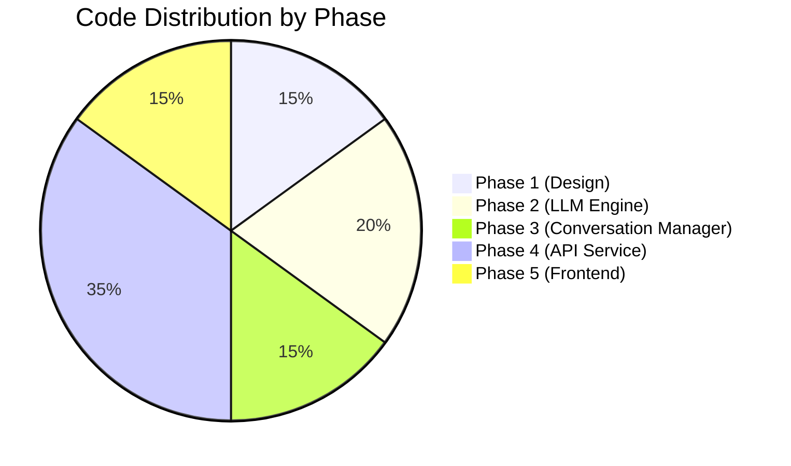

| Metric | Value |
|--------|-------|
| **Total Lines of Code** | ~3,500 |
| **Python Files** | 7 |
| **Jupyter Notebooks** | 3 |
| **HTML/CSS/JS** | 2 files (~1,200 lines) |
| **Docker Images** | 1 |
| **API Endpoints** | 6 (REST) + 1 (WebSocket) |
| **Test Cases** | 12+ |
| **Documentation** | 5 markdown files |

---

<div align="center">

**Built with ❤️ for Grand Stay Hotel** 🏨

*Elevating guest experiences through conversational AI*

</div>
